# TikZlings

[](https://www.latex-project.org/lppl.txt)
[](https://github.com/samcarter/tikzlings/releases/latest)
[](https://ctan.org/pkg/tikzlings)

A collection of animals and other beings from the TikZ world.

A big thank you to all the people who contributed with code, ideas or feedback to the package! Without this package would not exist!

## Available TikZlings

<a href="./examples/anteater.tex"></a>
<a href="./examples/ape.tex">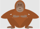</a>
<a href="./examples/bat.tex"></a>
<a href="./examples/bear.tex"></a>
<a href="./examples/bee.tex">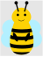</a>
<a href="./examples/bug.tex">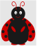</a>
<a href="./examples/cat.tex">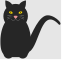</a>
<a href="./examples/chicken.tex">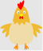</a>
<a href="./examples/coati.tex"></a>
<a href="./examples/dog.tex"></a>
<a href="./examples/elephant.tex"></a>
<a href="./examples/hippo.tex"></a>
<a href="./examples/koala.tex"></a>
<a href="./examples/marmot.tex"></a>
<a href="./examples/meerkat.tex">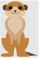</a>
<a href="./examples/mouse.tex"></a>
<a href="./examples/moles.tex"></a>
<a href="./examples/owl.tex">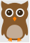</a>
<a href="./examples/panda.tex"></a>
<a href="./examples/penguin.tex"></a>
<a href="./examples/pig.tex"></a>
<a href="./examples/rhino.tex"></a>
<a href="./examples/sheep.tex"></a>
<a href="./examples/sloth.tex">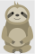</a>
<a href="./examples/snowman.tex"></a>
<a href="./examples/squirrel.tex">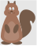</a>
<a href="./examples/wolf.tex">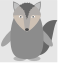</a>

## Usage

A short example to demonstrate the use of the TikZlings:

```
\documentclass{standalone}

\usepackage{tikzlings}

\begin{document}

\begin{tikzpicture}
\marmot
\end{tikzpicture}	
	
\end{document}
```

An exhaustive list of possible options can be found in [package documentation](https://github.com/samcarter/tikzlings/blob/main/DOCUMENTATION.pdf)

## Some examples

<a href="./showcase/Napoleon.svg">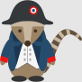</a>
<a href="./showcase/Alfred_the_mouse.svg"></a>
<a href="./showcase/Latex3_bear.svg"></a>
<a href="./showcase/Marmot_geek.svg"></a>
<a href="./showcase/Miss_marmot.svg"></a>
<a href="./showcase/Mouse_chocolate.svg"></a>
<a href="./showcase/Winter_pig.svg"></a>
<a href="./showcase/Winter_marmot.svg"></a>
<a href="./showcase/Wild_west_marmot.svg"></a>
<a href="./showcase/Roller_skates_koala.svg"></a>
<a href="./showcase/Roller_skates_pig.svg"></a>
<a href="./showcase/Nurse.svg"></a>
<a href="./showcase/Aouda.svg">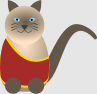</a>
<a href="./showcase/Phileas_Fogg.svg"></a>
<a href="./showcase/Passepartout.svg"></a>
<a href="./showcase/Hang_gliding_pingu.svg"></a>
<a href="./showcase/Hang_gliding_bear.svg">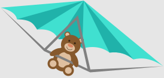</a>
<a href="./showcase/Tartan.svg">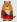</a>
<a href="./showcase/Haggis.svg"></a>
<a href="./showcase/Marmot_cupid.tex"></a>

<a href="./showcase/Bruegel.svg"></a>
<a href="./showcase/ElGreco.svg"></a>
<a href="./showcase/Last_supper.svg"></a>
<a href="./showcase/Vitruvian_coati.svg"></a>

<a href="./showcase/lt3marmot.tex"></a>
<a href="./showcase/Coati_custom_body.tex">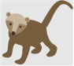</a>
<a href="./showcase/Jumping_marmot_ballon.tex">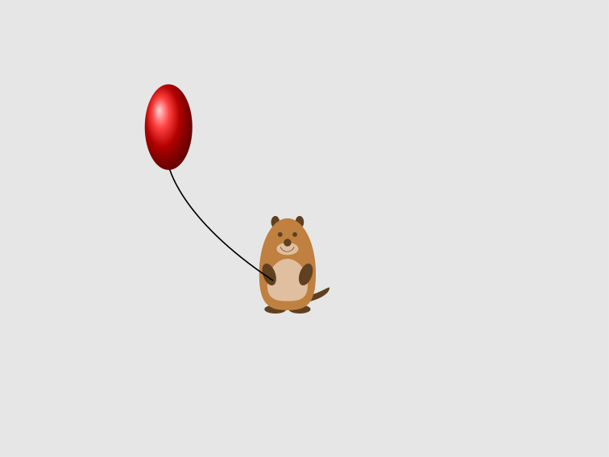</a>
<a href="./showcase/Mandala.tex">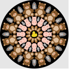</a>
<a href="./showcase/Mandala2.tex">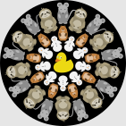</a>
<a href="./showcase/Marmobil.svg">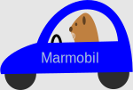</a>
<a href="./showcase/Marmot_side.svg"></a>
<a href="./showcase/Spherical_pig.tex">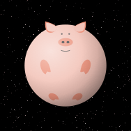</a>
<a href="./showcase/Rodent_Hood.tex">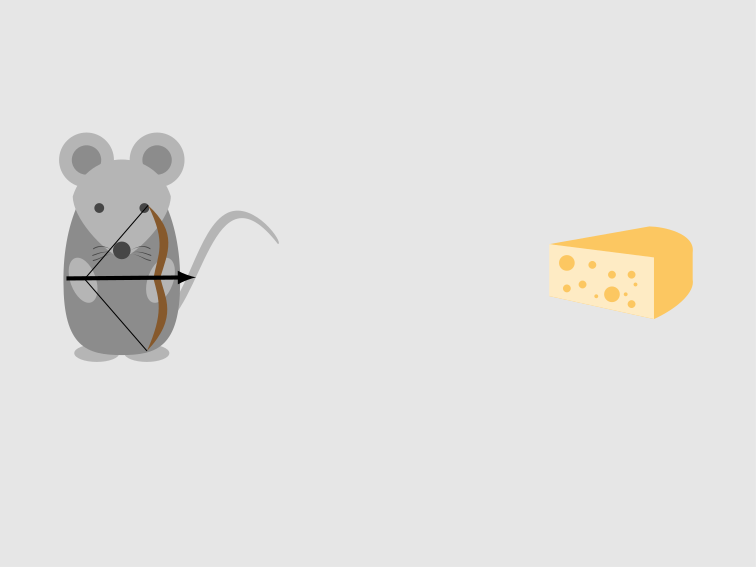</a>

## TikZlings in action

If you would like to observe TikZlings in their natural habitat, head over to the [TikZlings organisation](https://github.com/TikZlings/).

