# TikZlings

[](http://www.latex-project.org/lppl.txt)
[](https://github.com/samcarter/tikzlings/releases/latest)
[](https://ctan.org/pkg/tikzlings)

A collection of animals and other beings from the tikz world.

A big thank you to all the people who contributed with code, ideas or feedback to the package! Without this package would not exist!

## Available TikZlings

<a href="./Examples/anteater.tex"></a>
<a href="./Examples/bear.tex"></a>
<a href="./Examples/bee.tex">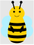</a>
<a href="./Examples/cat.tex">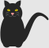</a>
<a href="./Examples/chicken.tex">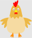</a>
<a href="./Examples/coati.tex"></a>
<a href="./Examples/elephant.tex"></a>
<a href="./Examples/hippo.tex"></a>
<a href="./Examples/koala.tex"></a>
<a href="./Examples/marmot.tex"></a>
<a href="./Examples/mole.tex"></a>
<a href="./Examples/mouse.tex"></a>
<a href="./Examples/owl.tex"></a>
<a href="./Examples/panda.tex"></a>
<a href="./Examples/pingu.tex"></a>
<a href="./Examples/pig.tex"></a>
<a href="./Examples/rhino.tex"></a>
<a href="./Examples/sheep.tex"></a>
<a href="./Examples/sloth.tex"></a>
<a href="./Examples/squirrel.tex"></a>
<a href="./Examples/snowman.tex"></a>

## Usage

A short example to demonstrate the use of the TikZlings:

```
\documentclass{standalone}

\usepackage{tikzlings}

\begin{document}

\begin{tikzpicture}
\marmot
\end{tikzpicture}	
	
\end{document}
```

An exhaustive list of possible options can be found in [package documentation](./documentation.pdf)

## Some examples


<a href="./ViewingPlatform/Napoleon.svg"></a>
<a href="./ViewingPlatform/Alfred_the_mouse.svg"></a>
<a href="./ViewingPlatform/Latex3_bear.svg"></a>
<a href="./ViewingPlatform/Marmot_geek.svg"></a>
<a href="./ViewingPlatform/Miss_marmot.svg"></a>
<a href="./ViewingPlatform/Mouse_chocolate.svg">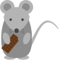</a>
<a href="./ViewingPlatform/Winter_pig.svg"></a>
<a href="./ViewingPlatform/Winter_marmot.svg"></a>
<a href="./ViewingPlatform/Wild_west_marmot.svg"></a>
<a href="./ViewingPlatform/Roller_skates_koala.svg"></a>
<a href="./ViewingPlatform/Roller_skates_pig.svg"></a>
<a href="./ViewingPlatform/Nurse.svg"></a>
<a href="./ViewingPlatform/Aouda.svg">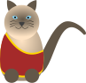</a>
<a href="./ViewingPlatform/Phileas_Fogg.svg"></a>
<a href="./ViewingPlatform/Passepartout.svg">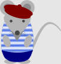</a>
<a href="./ViewingPlatform/Hang_gliding_pingu.svg">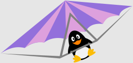</a>
<a href="./ViewingPlatform/Hang_gliding_bear.svg"></a>
<a href="./ViewingPlatform/Tartan.svg"></a>
<a href="./ViewingPlatform/Haggis.svg">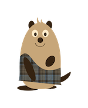</a>
<a href="./ViewingPlatform/Marmot_cupid.tex">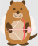</a>


<a href="./ViewingPlatform/Bruegel.svg"></a>
<a href="./ViewingPlatform/ElGreco.svg">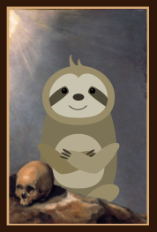</a>
<a href="./ViewingPlatform/Last_supper.svg"></a>
<a href="./ViewingPlatform/Vitruvian_coati.svg">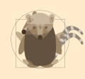</a>


<a href="./ViewingPlatform/lt3marmot.tex"></a>
<a href="./ViewingPlatform/Coati_custom_body.tex"></a>
<a href="./ViewingPlatform/Jumping_marmot_ballon.tex">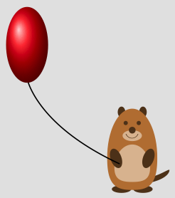</a>
<a href="./ViewingPlatform/Mandala.tex"></a>
<a href="./ViewingPlatform/Mandala2.tex"></a>
<a href="./ViewingPlatform/Marmobil.svg"></a>
<a href="./ViewingPlatform/Marmot_side.svg"></a>
<a href="./ViewingPlatform/Spherical_pig.tex"></a>
<a href="./ViewingPlatform/Rodent_Hood.tex">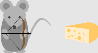</a>


## TikZlings in action

Several TikZlings are featured in the following videos:

<a href="https://vimeo.com/305374856"></a>
<a href="https://vimeo.com/380684973"></a>
<a href="https://vimeo.com/492532561"></a>

The source code of the movies is available from [The great TikZlings Christmas Extravaganza 2018](https://github.com/samcarter/Extravaganza2018), [The great TikZlings Christmas Extravaganza 2019](https://github.com/samcarter/Extravaganza2019) and [The great TikZlings Christmas Extravaganza 2020](https://github.com/samcarter/Extravaganza2020).


